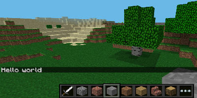
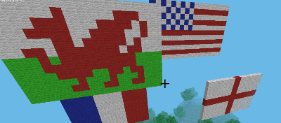
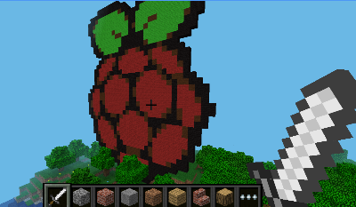

# Minecraft Pi Projects for Code Clubs

Created for use in a code club for 8-14 year olds at [The National Museum of Computing](https://www.tnmoc.org/) in Bletchley Park.

## Getting Started

1. Clone this repository into a new folder on your pi.

```bash
git clone https://github.com/jonculver/minecraftpi.git minecraftpi
cd minecraftpi
```

2. Launch minecraft pi

3. Try running `hello_world.py` and checking that you see 'hello world' in the minecraft console

```bash
python examples/hello_world.py
```



## Projects

### Flags

Use loops and lists to make giant flags using [These instructions](docs/flags.md)



### Drawing

A demonstration of using python image manipulation library to turn a picture into a minecraft object. Check it out [here](docs/draw.md). 


