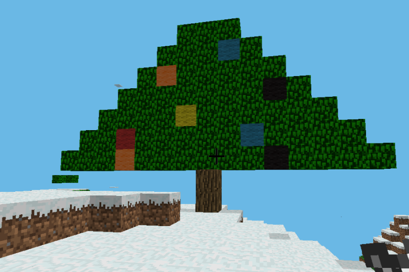
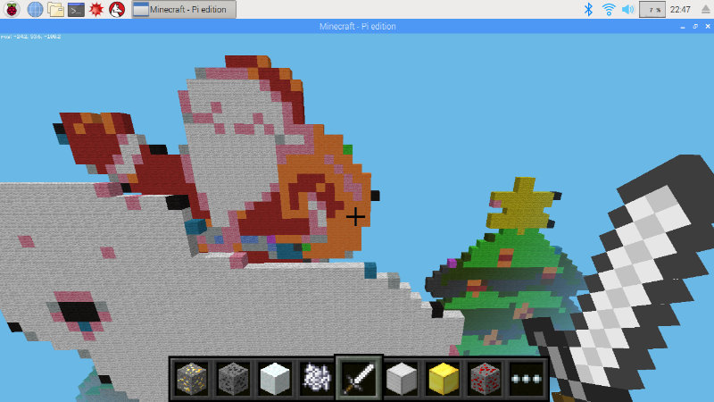

# Christmas Activities

## 1. Draw a Christmas Tree

Use `setBlocks` to draw a Christmas Tree with baubles.



1. Copy the code below to find the player position

```python
import utils
from mcpi.minecraft import Minecraft
from mcpi import block
from mcpi_utils.wool import setWoolBlock

mc = Minecraft.create()

# Find our current position
x, y, z = mc.player.getPos()

# Start a little way away
x += 10
```

2. Use `setBlocks` to draw the trunk. You need to select a starting point (x1, y1, z1) and an ending point (x2, y2, z2) so that it fills in a 2x1 rectangle with Wood blocks.

```python
# Draw trunk
mc.setBlocks(x1, y1, z1, 
             x2, y2, z2,
             block.WOOD.id)
```

3. Use `SetBlocks` with `block.LEAVES.id` to fill in the leaves. Use a loop with `for i in range(7)` . What should the width and height be for each value of i?

```python
# Draw leaves
for i in range(7):
    width = ???
    height = ???
    mc.setBlocks(???)
```

4. Add some baubles using `setWoolBlock` and the colour codes from the [flags exercise](./flags.md), and finally add a star on the top with `setBlock`, perhaps using glowstone.

```python
# Add some baubles
setWoolBlock(mc, x, y+2, z-4, "R")
setWoolBlock(mc, x, y+3, z+2, "Y")
...

# Add the star
mc.setBlock(x, y+9, z, block.GLOWSTONE_BLOCK.id)
```

## 2. Create a Winter Wonderland

Fill your Minecraft world with snow and giant christmas characters



1. Open and run `examples/winter_wonderland.py`. This will run until you stop it.
2. In your minecraft world create a snow block and hit it (right-click with your sword selected). Watch the ground around you be covered in snow.
3. Try creating various ore blocks and hitting them.

## 2. Create a Christmas Tree

Use the turtle 

Here's the code to draw the trunk and get into position to draw the leaves

```python
import utils
from mcpi.minecraft import Minecraft
from mcpi import block
from minecraftstuff import MinecraftTurtle
from mcpi_utils.wool import WoolColors

mc = Minecraft.create()

# Find our current position
x, y, z = mc.player.getPos()

# Start a little way away and above the ground
x += 10
y += 1

# create minecraft turtle
steve = MinecraftTurtle(mc)

steve.setposition(x, y, z)
steve.speed(10)

# Draw trunk
steve.penblock(block.WOOD.id)
steve.up(90)
steve.forward(2)

# Draw Leaves
steve.penblock(block.LEAVES.id)
steve.down(90)
steve.right(90)
```

