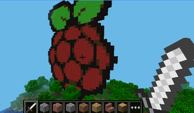

# Drawing pictures in Minecraft Pi

A demonstration of how python image manipulation can be used to quickly create objects in Minecraft.

## Setup

This program uses `Pillow`, which is an image manipulation library for Python. It came already installed on my Raspberry Pi, but if you find it is missing then it can be installed using.

```
sudo pip install Pillow
```

## Drawing an image

Test out the tool by opening and running `examples/draw.py`. You should find a giant raspberry appear in your world!



## Drawing your own images

Take a copy of draw.py and try drawing other images. You can use any image saved on your pi or you can try with `images/rainbow.py`.

Try making them larger or smaller.

## Further Extensions

Try making images more than one block thick by drawing the image multiple times. 


