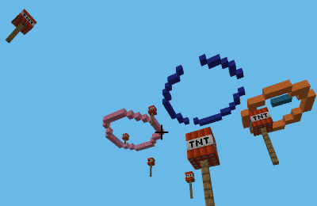
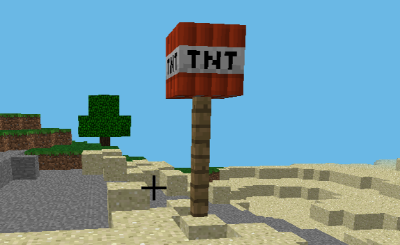
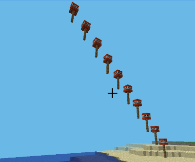
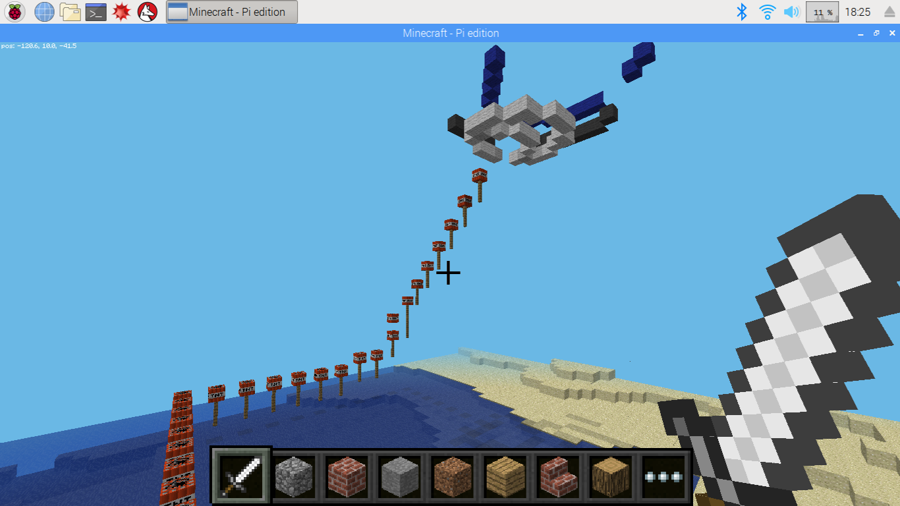

# Firework Display

This project creates a firework display, launching rockets in patterns of your design.



## Setup

Follow the instructions in the [README](../README.md) to make sure minecraft is running and your code can interact with it.

Create a new file called `students/fireworks_<name>.py` to store your code and copy and paste the code below

```python
import utils
import time

from mcpi_utils.firework import Firework
from mcpi import minecraft

# Create a minecraft instance
mc = minecraft.Minecraft.create()

# Find our current position
x, y, z = mc.player.getPos()

# Set the start position a short distance away
x += 10
```

## Part 1: Create a Rocket

At the end of your file add the following code to create a Firework object near your current position. We need to specify the minecraft instance to create it in and the X and Z coordinates. The Y coordinate isn't requied as it always starts on the ground.

```python
# Create Fireworks
rocket = Firework(mc, x, z)
```

Now run your code and you should see your rocket - A stick with some dynamite on the top. Be careful - if you hit it then it will explode!



## Part 2: Launch Your Rocket

Firework objects come with a `move()` method and a `finished()` method. To launch our rocket we need to repeatedly call the move method until it is finished like this:

```python
# Launch Fireworks
while not rocket.finished():
    rocket.move()
```

If you run this you'll find that the rocket moves very quickly. We can slow it down a bit by waiting for a fraction of a second after every move. Add the following after calling move and you should have a nice firework.

```python
    time.sleep(0.1)
```

## Part 3: Launching Many Rockets

One firework doesn't make a display so let's instead create a number of rockets and store them in a list. We want them all to start in slightly different places so vary the Z coordinate of each one.

The `range(n)` function creates a list of numbers from 0 to n-1

Replace the code under `#Create Fireworks` code with this:

```python
# Create Fireworks
rockets = []

for i in range(10):
    gap = i * 2
    rocket = Firework(mc, x, z + gap)
    rockets.append(rocket)
```

If you run your code now you'll find that only the last rocket lifts off. We need to modify our launch code so that it calls `move()` for every rocket in the list and only finishes when every rocket is finished. Each time we move a rocket check whether it is finished and if so, remove it from the list.

```python
# Launch Fireworks
while len(rockets) > 0:
    for r in rockets:
        r.move()
        if r.finished():
            rockets.remove(r) 
    time.sleep(0.1)
```

Now all the rockets should launch.

## Part 4: Adding A Delay

Launching all the rockets at once doesn't make for a great display. Fortunately the Firework object also has a `delay` parameter that sets how long it should wait before it launches. If you set a delay of `5` then the first 5 times you call `move()` will do nothing and only after that will the rocket launch.

Add the delay parameter to your code that creates rockets as follows:

```python
   rocket = Firework(mc, x, z + gap, delay=gap)
```

Try running your code now and you should see the rockets lift off in sequence.



## Part 5: Create A Display

Now you are ready to create your own fireworks display. Create patterns of fireworks with different delays and then launch them all. 

Fireworks also have an optional `color` parameter that you might find useful. It accepts letter codes shown in the [flags](./flags.md) exercise. So to create a red firework use

```python
Firework(mc, x, z, delay=0, color="R")
```

For example here's some code to create a square of fireworks that all launch in order

```python
# Create a square of fireworks. Start by setting the delay, x delta and z delta
# to zero, and modify them as we move around the sides
delay = 0
dx = 0
dz = 0

# First side of a square - increase Z
for i in range(10):
    dz += 2
    delay += 2
    rocket = Firework(mc, x + dx, z + dz, delay=delay)
    rockets.append(rocket)

# Second side of a square - increase X
for i in range(10):
    dx += 2
    delay += 2
    rocket = Firework(mc, x + dx, z + dz, delay=delay)
    rockets.append(rocket)

# Third side of a square - decrease Z
for i in range(10):
    dz -= 2
    delay += 2
    rocket = Firework(mc, x + dx, z + dz, delay=delay)
    rockets.append(rocket)

# Fourth side of a square - decrease X
for i in range(10):
    dx -= 2
    delay += 2
    rocket = Firework(mc, x + dx, z + dz, delay=delay)
    rockets.append(rocket)
```

