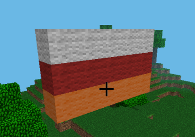
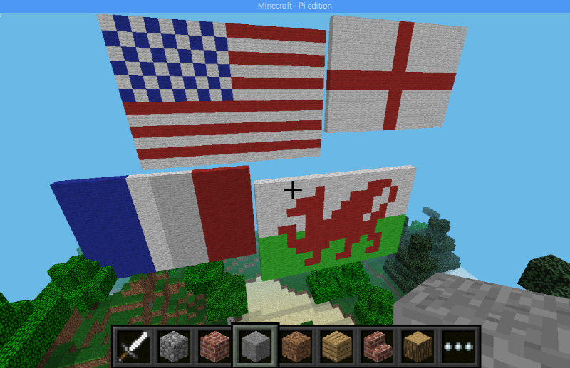

# Minecraft Pi Flag Builder

This project uses iteration and the `enumerate` function to build giant flags in minecraft.


## Setup

Follow the instructions in the [README](../README.md) to make sure minecraft is running and your code can interact with it.

Create a new file `students/flags_<name>.py` to store your code and add the following code at the top

```python
import utils

from mcpi_utils.wool import setWoolBlock
from mcpi import minecraft

# Create a minecraft instance
mc = minecraft.Minecraft.create()
```

## Part 1: Creating Wool Blocks

Wool blocks come in a range of colours that are perfect for making flags. We are going to use a helpful utility function called `setWoolBlock` to build a block of a specified colour at a specific (x,y,z) coordinate. 

Add the following code at the bottom of your file and try running it

```
x, y, z = mc.player.getPos()

setWoolBlock(mc, x, y, z, "W")
```

This finds the co-ordinates of your character and then creates a white wool block under your feet. 

**Challenge 1:** Try adding more calls to `setWoolBlock` to create more blocks in different positions. Can you make a horizontal 3x3 square? How about vertical?**

**Challenge 2:** Try creating some more colours by changing the final parameter to `setWoolBlock` using the table below. Can you make a pattern?

| Colour | Letter | Colour     | Letter |
| ------ | ------ | ------     | ------ |
| BROWN  | A      | BLACK      | B      |
| CYAN   | C      | GREEN      | G      |
| GREY   | H      | LIGHT GREY | I      |
| LIME   | L      | MAGENTA    | M      |
| ORANGE | O      | PINK       | P      |
| PURPLE | Q      | RED        | R      |
| BLUE   | U      | LIGHT_BLUE | V      |
| WHITE  | W      | YELLOW     | Y      |


## Part 2: Using Loops with `range` and `len`

Creating a pattern one block at a time is a slow process. If we want to create a line of blocks we could specify them as a string and then write a function to create them all. For example 5 red blocks would be "RRRRR".

In python a string can be treated as a list of characters so `"RRRRR"` is similar to `["R","R","R","R","R"]`.

The `len` function gives the length of a list. For example:

```
>>> list = "RRRRR"
>>> len(list)
5
```

The `range` function gives a list of numbers up to a specified value. Like most things in computing it starts from zero. For example:

```
>>> range(5)
[0, 1, 2, 3, 4]
```

**Challenge 3:** Fill in the code below to create a row of blocks:

```python
for i in range(len(list)):
    # Create block at position x + i with colour list[i]
```

**Challenge 4:** Can you make a rainbow column like this?


## Part 3: Loops with `enumerate`

In our loop we used both the current element in the list and the *index* of that element (the position within the list where it appears). This is a common pattern and python provides the `enumerate` funtion to do exactly this as shown in this example:

```python
for index, element in enumerate("abc"):
    print("{}, {}".format(index, element))
```
```text
0, a
1, b
2, c
```

**Challenge 5:** Rewrite your loop to use `enumerate` instead of `range` and `len`

## Part 4: Moving to Two Dimensions

So far we've used one loop to make a row _or_ a column. Now we need to do both, to build a square or a rectangle from a list of strings like this:

```python
area = ["WWRWW",
        "RRRRR",
        "WWRWW"]
```

We need to use two loops. The inner one is the one we already have, to build a single row of blocks, and the outer one moves along each row in turn.

**Challenge 6:** Fill in the code below so it correctly builds the area as shown below

```python
for dy, row in enumerate(area):
    for dx, colour in enumerate(row):
        # Create block at position x + dx, y + dy, z with the specified colour 
```

**Hint**: We want to build the flags _downwards_ from the top row



## Part 5: Making Flags

Now we are ready to make some really big flags. We could write out an 18x12 England flag like this:

```python
ENGLAND = ["WWWWWWWWRRWWWWWWWW",
           "WWWWWWWWRRWWWWWWWW",
           "WWWWWWWWRRWWWWWWWW",
           "WWWWWWWWRRWWWWWWWW",
           "WWWWWWWWRRWWWWWWWW",
           "RRRRRRRRRRRRRRRRRR",
           "RRRRRRRRRRRRRRRRRR",
           "WWWWWWWWRRWWWWWWWW",
           "WWWWWWWWRRWWWWWWWW",
           "WWWWWWWWRRWWWWWWWW",
           "WWWWWWWWRRWWWWWWWW",
           "WWWWWWWWRRWWWWWWWW"]
```

But a lot of the rows are the same so we can make it a lot shorter like this:

```python
r1 = "WWWWWWWWRRWWWWWWWW"
r2 = "RRRRRRRRRRRRRRRRRR"
ENGLAND = [r1] * 5 + [r2] * 2 + [r1] * 5
```

France is even easier

```python
FRANCE = ["UUUUUUWWWWWWRRRRRR"] * 12
```

or even 

```python
FRANCE = ["U" * 6 + "W" * 6 + "R" * 6] * 12
```

**Challenge 7:** Which other countries' flags do you know? Make some more and scatter your world with giant flags.


